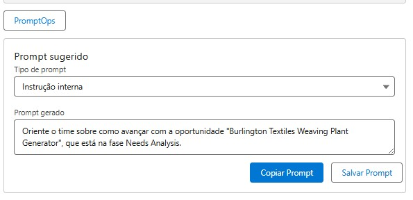

# promptops-layer

**PromptOps Layer** é um projeto Salesforce Lightning desenvolvido para facilitar a construção e reaproveitamento de prompts no Prompt Builder da Salesforce. Ele atua como uma camada intermediária entre usuários e registros, sugerindo prompts otimizados com base no tipo de objeto e ação realizada.

---

## ⚙️ Funcionalidades

- Geração e edição manual de prompts com base no contexto de registros.
- Sugestões dinâmicas de prompt com base no tipo de objeto (Case, Lead, Opportunity, Account, Contact).
- Armazenamento em objeto customizado `Prompt_Log__c`, com:
  - Tipo de prompt (picklist)
  - Texto do prompt
  - Objeto relacionado (`ObjectApiName__c`)
  - ID do registro (`RecordId__c`)
  - Data/hora de uso (`UsedOn__c`)
- Botões para copiar e salvar o prompt.
- Interface leve e responsiva em LWC.

---
## Estrutura de dados
🔸 Custom Metadata: Prompt_Config__mdt
Field Label	API Name	Type	Descrição
Prompt Text	Prompt_Text__c	Long Text Area	Texto-base do prompt sugerido
Prompt Type	Prompt_Type__c	Text	Tipo do prompt (ex: Resumo, Instrução)
Object Type	Object_Type__c	Text	Nome da API do objeto (ex: Case, Lead)
Is Active	Is_Active__c	Checkbox	Define se a configuração está ativa

## 🚀 Como instalar

1. Clone ou baixe este repositório.
2. Suba os arquivos LWC e Apex para sua org usando o VS Code com Salesforce CLI.
3. Crie os seguintes campos no objeto customizado `Prompt_Log__c`:

| Field Label     | API Name         | Type              |
|----------------|------------------|-------------------|
| Prompt         | Prompt__c        | Long Text Area    |
| Prompt Type    | PromptType__c    | Picklist          |
| Record ID      | RecordId__c      | Text(18)          |
| Used On        | UsedOn__c        | Date/Time         |
| Object API Name| ObjectApiName__c | Text(255)         |

4. Adicione o componente `promptOpsLayer` em uma Lightning Record Page (ex: Opportunity, Case etc).

---

## 💡 Próximas funcionalidades (em planejamento)

- Marcar prompts como favoritos.
- Exibir lista com prompts recentes do usuário.
- Filtro por objeto e tipo de ação.
- Exportação de prompts em massa.

---

## 📸 Captura de tela

---

## 👨‍💻 Autor

Márcio Silveira  
Desenvolvedor Salesforce  
[LinkedIn](https://www.linkedin.com/in/marciosilveira-0873/)  
[GitHub](https://github.com/marciosilver)

---

## 📄 Licença

Este projeto está licenciado sob a Licença MIT.
